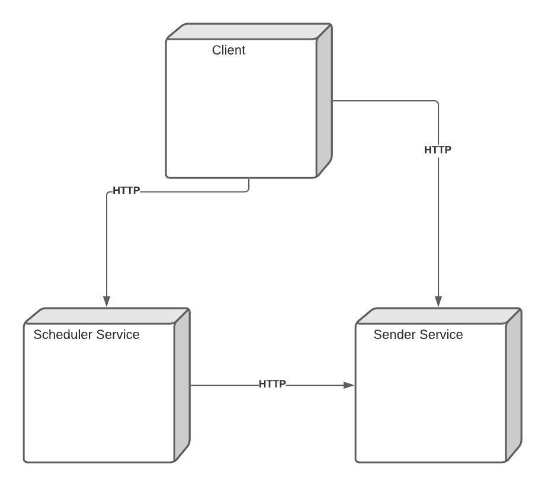
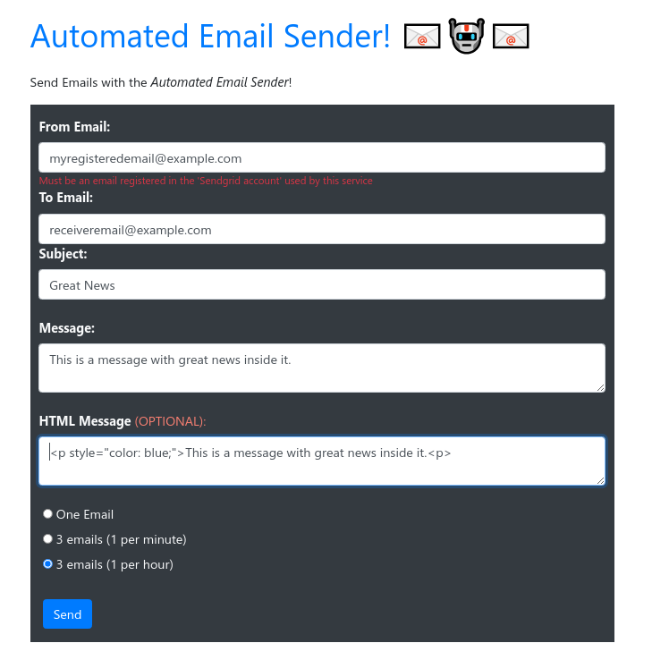

# Automated Email Sender System

## General Description:

This system was designed to allow sending and scheduling emails to be sent in any specific date (scheduled emails) or just sending them immediately (event-based emails).  With just those two functionalities it's possible to do some interesting things such as starting to implement a custom notification system for any application.

That could be useful to automate some processes associated with that application such as _Notifying End Users or Admin Users about some change on the status of some application component or database_ or maybe _Notifying other systems or services about some change automatically_ to give them hints on what to do at a given time, without needing constant human intervention/supervision.

## Services Description:

It does its work by using its _three components_, which are:

**The Client:** A web frontend that can be used to consume the services, it's possible to add more features, but for now it's possible to send a specific email immediately or to schedule 3 emails with 2 different options (1 per minute and 1 per hour). With those functions is more than enough to have a functional and useful demo which is relatively easy to use, and understand.

**The Sender Service:** Responsible for sending emails using a sender service, currently there's an implementation that uses the **Sendgrid API** to send emails, so to be able to send emails, it's a MUST to have a **Sendgrid Account** associated with this service (by configuring an _API KEY_ in the environment variables of this service.

**The Scheduler Service:** It's responsible of doing the following activities: _Scheduling Emails_; _Read Scheduled emails and their status_ "PENDING" or "SENT"; _Watch the scheduled emails and send pending emails_ based on the current status of the emails. To send emails it uses the _"Sender Service"_.

To clarify how all the parts of this system works together the deployment diagram will be shown next:

> **The client** communicates with both _The Scheduler Service_ and _The Sender Service_ to send and schedule emails to be sent later. **The Scheduler Service** communicates with _The Sender Service_ to send scheduled emails when their date was just expired (it checks the date each 30 seconds and send the "expired emails"). finally, **The sender Service** has no dependency on the other deployed components, it just send emails when its told to.

## A brief description of the client:

*Screenshot of the web client, which is a form rendered in a single webpage.*

Here's an example on how to use the form, It's generally the same for every case, the only thing that changes in every case is the behaviour of the Emails and the communication between the client and the services.

The first two options "One Email", and "3 emails (1 per minute)" are recommended because they're faster to test and cover the complete functionality, nonetheless, there's an option to send emails each hour to better simulate a different scenario, sending emails at specific times of the day.

## How to install and run it:

All of the three components of the system were made using NodeJS, and of those three services, only **The Sender Service** was made using Typescript, because it was thought that it would change more oftenly, by adding more features or by connecting it to other **Email SaaS Web Services** (Alternative to Sendgrid).

### General instructions:

The general process on how to install the services/components of the system is more or less the same for all of them:

* Be sure to have NodeJS installed.
* Install the dependencies specified in the "package.json" of each service.
* Configure Environment variables
* Run the services.

### Specific instructions:

Now I'll show the specific instructions to install everything from beginning and check that the system works correctly

#### Install the Sender Service.

This is used by both **The Client** and **The Scheduler Service** so it's a good idea to install it first.

1. From a CLI run the following commands:

> cd sender-service
> npm install

2. After that, create a **.env** file by copying the file **.env_sample** to **.env** and modifying its configurations to something like this:

> API\_KEY=YOUR\_SENDGRID\_API\_KEY\_GOES\_HERE
> PORT=4550

3. Finally, just run the service

> npm start

#### Install the scheduler Service.

With the **Sender Service** installed, it's a good idea to continue with the **Scheduler Service**.

1. From a CLI run the following commands:

> cd scheduler-service
> npm install

2. After that, create a **.env** file by copying the file **.env_sample** to **.env** and modifying its configurations to something like this:

> PORT=4551
> SENDER\_SERVICE\_API=http://localhost:4550
> CRON\_PERIODICITY=\*/30 \* \* \* \* \*

3. Finally, run the service

> npm start

4. With this configuration, each 30 seconds, emails will be checked and if they're any pending emails in the service's database, they will be sent when their date has been expired.

#### Install the client.

Finally, there's the client, this part is also important but it can be changed easily to any other client that consumes the two aforementioned services, that way, a __"Mobile Version of this Client"__ could be implemented and it should work just fine, because all the communications between services are made using the HTTP protocol.

1. From a CLI run the following commands:

> cd client

> npm install

2. After that, create a **.env** file by copying the file **.env_sample** to **.env** and modifying its configurations to something like this:

> CLIENT\_PORT=3000
> SENDER\_SERVICE\_API=http://localhost:4550
> SCHEDULER\_SERVICE\_API=http://localhost:4551

3. Finally, run the client.

> npm start

#### Conclusion:

After installing all of the previous services, you can test if everything is working fine manually by using the client. Remember that you'll need to have a Sendgrid Account with a valid API\_KEY and an authorized sender in that account to be able to send emails using the Sendgrid SaaS service.

